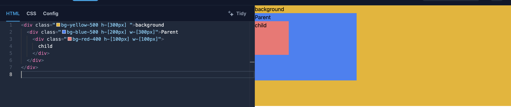
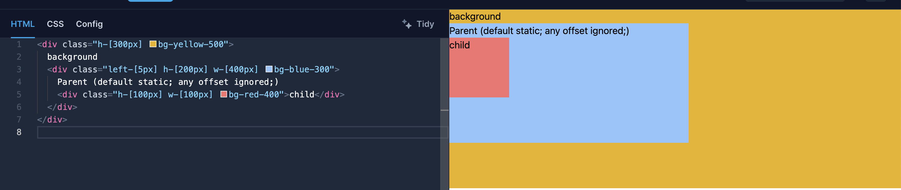
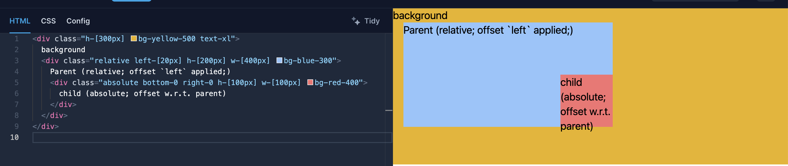
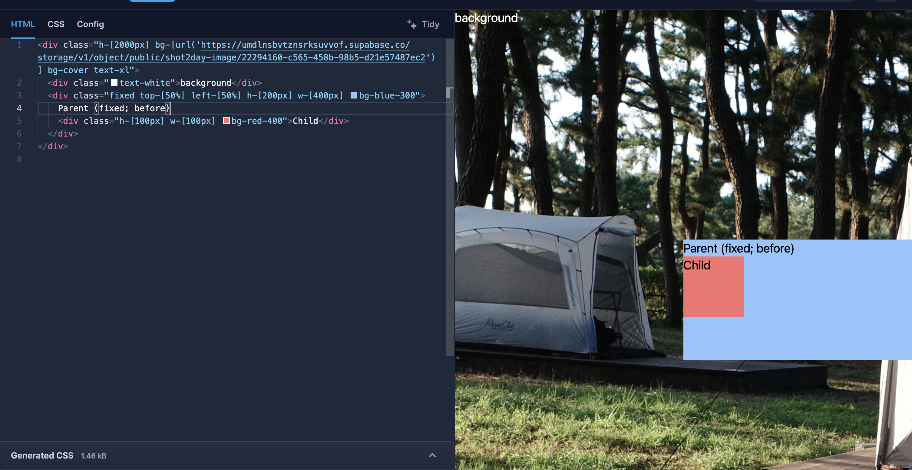
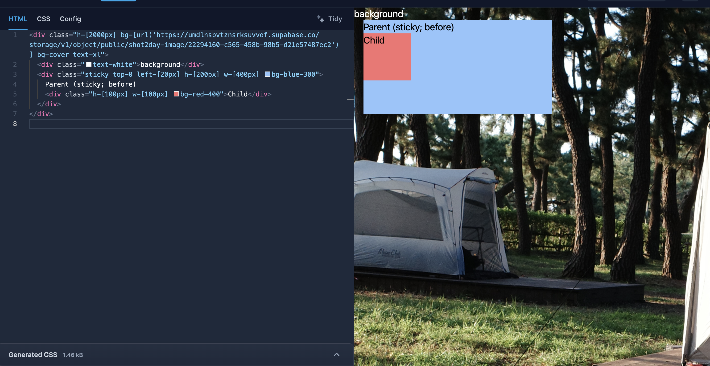
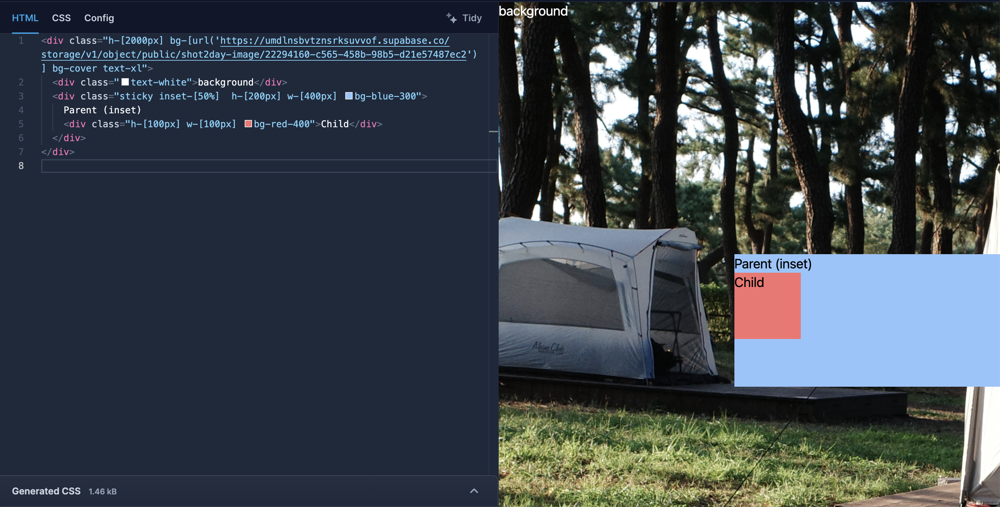

# TIL: CSS Positioning

사진의 메타데이터를 보여주는 상세창을 모달에서 별도의 페이지로 바꾸면서, 사진을 가장 잘 보여주는 레이아웃을 이것 저것 실험하다가, 지금껏 막연하게만 사용했던 position 속성과 관련 유용한 팁을 정리했다. 

총 5개의 position 속성값이 있다.
1. static (default)
2. absolute
3. relative
4. fixed
5. sticky

## static
> Use the static utility to position an element according to the normal flow of the document. [출처: tailwindcss](https://tailwindcss.com/docs/position)

기본값. 요소들의 기본 순서에 따라 배치됨.

`static`에서는 기존 요소 위치에서 이탈하는 정도를 조절하는 `offset`을 정의해도 적용되지 않는다.

## absolute & relative

이 속성이 가장 많이 쓰이는 경우는 특정 요소(`relative`)를 기준으로 자식 요소의 위치를 설정하기 위해 `absolute`를 사용한다. 이 `absolute`에 적용되는 offset 값은 상위 가장 가까운 `relative`의 위치를 기반으로 적용된다. 

-> 노란색 배경의 window/viewport가 아닌 `relative`가 적용된 (파란색) Parent 요소를 기준으로 `bottom-0 right-0`이 적용된 모습.

## fixed

(상위에 `relative` 요소가 없다면) viewport 기준으로 위치를 **고정**한다. 

(사진 배경의) viewport의 정가운데 (top/left 50%) 위치했다가 스크롤을 내려도

viewport의 정가운데 그대로 고정되어 있다.

## translate
위 코드에서는 parent div (파란색 블록)의 **시작점**이 viewport의 한가운데로 설정되어 있다. 그러나 div의 중심과 viewport의 중심을 일치시키기 위해 `translate`를 추가로 쓸 수 있다.

음수값(i.e. x축에서 왼쪽/y축으로 위쪽)으로 이동하려면 `-translate` 꼴로 사용할 수 있다.

## sticky

`static` + `fixed`가 섞인 속성값. 

에서 스크롤을 내리면

`top-0`의 값이 적용되어 "background"라는 string이 더이상 보이지 않는다.

## inset

v0로 코드를 작성하게끔 하면 `inset-0`을 자주 보게 된다. `margin-*`이나 `padding-*`처럼 top/bottom/left/right의 값을 쉽게 조정할 수 있게 하는 속성이다.

-> `inset-[50%]` 으로 `top-[50%] left-[50%]` 대체 

## ref
1. https://tailwindcss.com/docs/position#fixed-positioning-elements
2. https://www.youtube.com/watch?v=YEmdHbQBCSQ